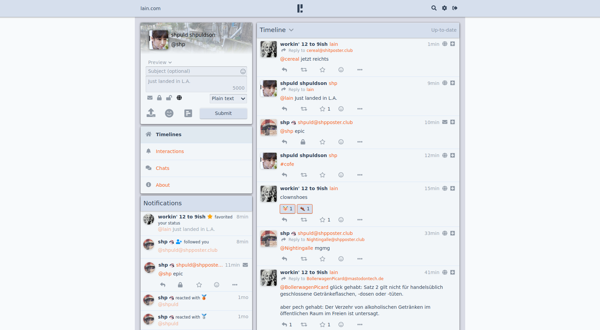
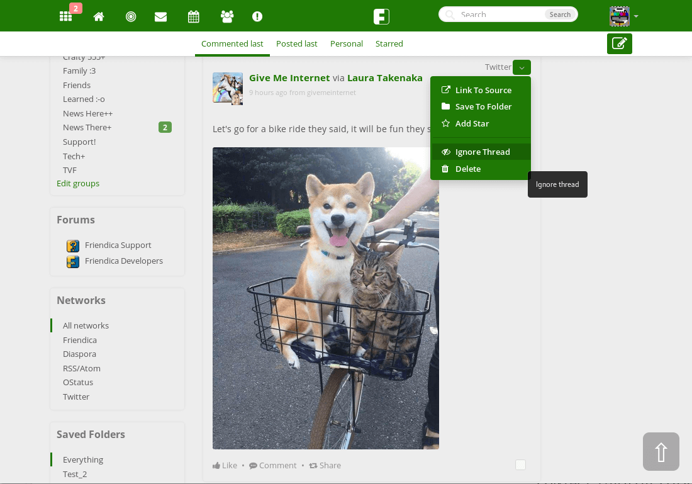

+++
title = "Dla użytkowników"
template = "section.html"
+++

[TOC]

Zanim przejdziemy do konkretnych platform trzeba wspomnieć o niezwykle ważnym dla serwisów zdecentralizowanych projekcie **Fediwersum** (ang. Fediverse). Nazwastała ze zlepienia słów **federacja** i **uniwersum**. Celem projektu jest stworzenie rozległej sieci serwerów, które poprzez implementację tych samych protokołów komunikacyjnych mogłyby bez przeszkód wymieniać pomiędzy sobą informacje.

W skład Fediwersum wchodzą różnego rodzaju platformy (m.in. mikroblogowe, społecznościowe, wideo). Posiadając konto na platformnie wchodzącej w skład Fediwersum możemy bez problemu obserwować użytkowników innych platform czy np. używać naszego konta na platformie mikroblogowej aby komentować filmy na platformie wideo. Dzięki temu Fediwersum rozwiązuje problem tożsamości i nie wymusza na nas tworzenia osobnych kont na każdej z tych platform. Dla odpowiedniego porównania wyobraźmy sobie sytuację, w której mamy możliwość użycia naszego konta Facebookowego do skomentowania filmu na YouTube lub konta Twitterowego do śledzenia znajomego na Facebooku. W sieci Fediwersum takie interakcje są możliwe bo wszystkie platformy się ze sobą dogadują.

Na poniższej liście platform zaznaczymy te, które wchodzą w skład Fediwersum.

## Platformy mikroblogowe

### Mastodon (Fediversum)

Mastodon to platforma mikroblogowa zbliżona do Twittera lecz oparta na otwartej sieci serwerów. Każdy serwer rządzi się swoimi własnymi prawami czego manifestacją jest regulamin serwera opisujący rzeczy, które nie są mile widziane przez administratorów. Często są to społeczności tematyczne skupione wokół wspólnych zainteresowań użytkowników lub regionalne łączące użytkowników z tego samego regionu.

* Strona projektu: [joinmastodon.org](https://joinmastodon.org/)
* Aplikacje klienckie: [joinmastodon.org/apps](https://joinmastodon.org/apps)
* Lista serwerów podzielona na kategorie: [joinmastodon.org/communities](https://joinmastodon.org/communities)
* Polskie serwery:
    * [101010.pl](https://101010.pl)
    * [fedi.lewactwo.pl](https://fedi.lewactwo.pl/)

### Pleroma (Fediversum)

Pleroma to kolejna alternatywa dla Twittera. Zawiera w sobie funkcjonalność Mastodona, do których durzuca kilka dodatkowych tj. reakcje w postaci emoticon. Podobnie jak Mastodon Pleroma komunikuje się za pomocą tego samego protokołu co Mastodon (ActivityPub) tym samym serwery używające Pleromy mogą swobodnie komunikować się również z serwerami Mastodona tworząc wspólnie jedną dużą sieć.

* Strona projektu: [pleroma.social](https://pleroma.social/)
* Aplikacje klienckie: [docs.pleroma.social/backend/clients/](https://docs.pleroma.social/backend/clients/)
* Lista serwerów: [fedidb.org/network?s=pleroma](https://fedidb.org/network?s=pleroma)
* Polskie serwery:
    * [fediverse.pl](https://fediverse.pl)

### Misskey (Fediversum)

Misskey to wywodząca się z Japonii platforma mikroblogowa. Z unikatowych funkcji jakie ma do zaoferowania Misskey, w odróżnienia od Mastodona czy Plermony, można wymieć funkcję dysku do przechowywania plików użytkownika, kalendarz, gry czy bardzo elastyczny interfejs użytkownika, który możemy dostosować do swoich upodobań.

* Strona projektu: [join.misskey.page](https://join.misskey.page/)
* Lista serwerów: [join.misskey.page/en-US/instances](https://join.misskey.page/en-US/instances)

## Platformy społecznościowe

### Diaspora (Fediversum)

Projekt Diaspora został powołany do życia w 2010 przez grupkę znajomych mających wspólny cel - zbudowanie serwisu społecznościowego, który oddałby kontrole z powrotem w ręce użytkowników. Obecnie Diaspora cieszy się dużą i stabilną grupą użytkowników. Wiele osób dołączyło do Diaspory w poszukiwaniu alternatyw dla platform tworzonych przez duże korporacje.

Diaspora posiada możliwość grupowania znajomych (aspekty) i udostępnienia treści tylko wybranym grupom. Oprócz tego znajdziemy tam również możliwość tworzenia ankiet, tagowanie treści, powiadomienia o urodzinach, dwu-etapową autoryzację czy wsparcie dla składni Markdown.

* Strona projektu: [diasporafoundation.org](https://diasporafoundation.org/)
* Aplikacja mobilna: [dandelion*](https://f-droid.org/en/packages/com.github.dfa.diaspora_android/)
* Lista serwerów: [the-federation.info/diaspora](https://the-federation.info/diaspora)

### Friendica (Fediversum)

Friendica celuje w bycie platformą dla każdego. Osoby przybywające z innych platform powinny tutaj czuć się jak w domu, odnajdując funkcjonalności znane z innych serwisów. Ze względu na niskie zużycie zasobów Friendica jest często wybierana przez administratorów serwerów. Jest dobrze zintegrowana z pozostałą częścią Fediversum przez co jej użytkownicy mogą z łatwością śledzić znajomych zamieszkujących inne usługo Fediversum.

* Strona projektu: [friendi.ca](https://friendi.ca/)
* Aplikacje mobilne: [github.com/friendica/friendica/wiki/Clients](https://github.com/friendica/friendica/wiki/Clients)
* Lista serwerów: [dir.friendica.social/servers](https://dir.friendica.social/servers)
* Polskie serwery: [dir.friendica.social/servers/pl](https://dir.friendica.social/servers/pl)

## Platformy wideo

### PeerTube (Fediversum)

W odróżnieniu od platform scentralizowanych PeerTube nie postrzega swoich użytkowników jako produktu, który można śledzić i pokazywać reklamy. Celem PeerTube'a jest stworzenie sieci powiązanych ze sobą platform przechowujących pliki wideo dając użytkownikom możliwość wybóru takiej platformy, która spełnia ich wymagania dotyczące zasad korzystania z serwisu oraz cenzury. Nie znajdziecie tutaj algorytmów rekomendujących kolejne filmy do obejrzenia czy konieczności oddawania komuś praw autorskich do naszych filmów. Strumieniowanie filmów odbywa się za pomocą sieci peer-to-peer (p2p) czyli użytkownicy oglądający materiały wideo automatycznie pomagają w transferze danych do pozostałych użytkowników chcących obejrzeć ten film.

* Strona projektu: [joinpeertube.org/pl/](https://joinpeertube.org/pl/)
* Aplikacje mobilne: [docs.joinpeertube.org/use-third-party-application](https://docs.joinpeertube.org/use-third-party-application)
* Lista serwerów: [joinpeertube.org/instances](https://joinpeertube.org/instances)
* Polskie serwery: [joinpeertube.org/instances](https://joinpeertube.org/instances) (przefiltruj po języku)
